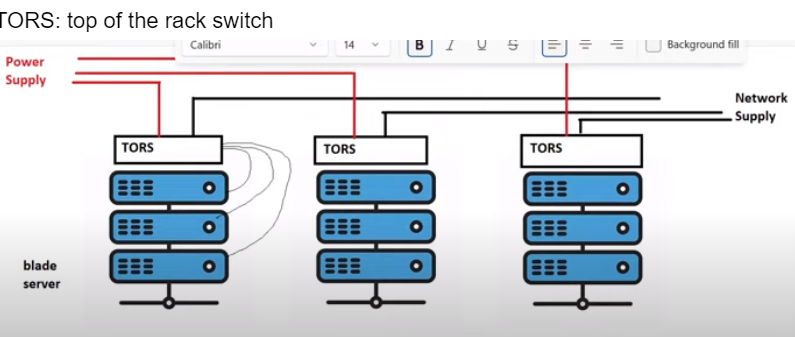
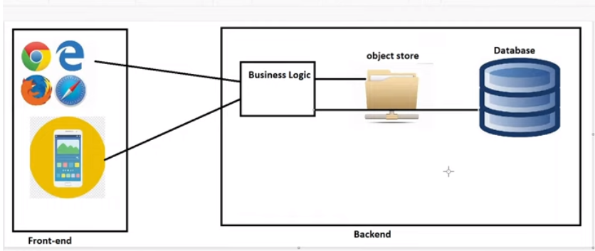

DOCKER

* Docker image and container : image nothing but package & container nothing but application . we want to build the package we required some  application .
* Container:software process created using OS virtualization  which  holds specific environment

Tower servers: designed put them on table/ground
Blade servers: arranged in racks  
DATABASE: data base not stores audios and videos it stores data of movies name , hero ,.......

We book  one ticket that ticket  number stores in database but the ticket booking pdf stores in objectstore.
Install: when ever you want to crome module systems(as user we update our whatsup)
Deploy:  take my application on some other place run on the servers (to give update on  organization )

In our ubuntu t2.micro instance we run one spring petclinic project but by using docker container  we run approximately 4 spring pet clinic projects. 
By using container we save our space & also continuous integration will be present on different ports.

Docker architecture 
Generation1: multiple services run by one network (monolithic)
Generation2: micro services (each server have different)cost is high
Generation3:docker (reducing cost )
Registry: collection of images hosted  for reuse is called registry
Dockershim: when we update the docker then also container will not stoped (it will be continuous to run)
OCI:(open container initiative)
 once the container is created the parent of the container will be dockershim.
To build docker image & container
###Docker image <command> < image>:<tag>
Docker image pull nginx : version
Ex: docker image pull busybox:3.15
To see the  all build images we use {docker image ls -q }

To see the run images only we use {docker image ls}

###Docker container <command> <container name>:<tags>

Docker container run/create nginx

RUN: to create and start the container

Hosts: it’s machines which running on docker

Entrypont: its used as a arg (it will never change)

args: arguments nothi

Cmd : we give any image name it change the CMD its cannot effect the entrypoint

Start: to create the container

Remove container we use  { docker container rm <containername>}

Remove al containers at a time {docker container rm $(docker container ls -a -q )}

Volume: when we delete the container total information can be deleted so we over come this problem to create the volumes
These volumes are two types those are 
        explicitly(manually): docker volume created by ours
       Automatically:these volume created by docker
Volumes are two types 
      Bind mount: its connected b/w  file system to container
      Tmpfs mount: its connected  between container to memory(ram)
Volume: we give only source
Mount: we give both source and destination
Hosts: it’s machines which running on docker 
Entrypont: its used as a arg (it will never change)
Cmd : we give any image name it change the CMD its cannot effect the entrypoint
Networking:  (ifconfig  & sudo apt install net-tools)we can’t install the docker in our machine we have only two network interfaces those are eth0 & lo, when ever we install docker we check the network by using  ifconfig command add another n/w is docker0.
 	Eth0: its tell about which physically connected to the s/m
	Io:
	Docker0:   this docker0 network is created only the only in 172.17.0.1 to 255.255.0.0 ip ranges only 
        Lib:  its creates the network interface inside the container only (in these eth0 have docker0 configurations)
Docker networks are three types
	Bridge: we use different networks (we used for multiple machines)(we communicate both ip& name in bridge network but in default bridge network we give only ip addresses)
	Host: we have same system where we create docker installed
	Null:  no network
Drawbacks of docker0 is  it’s not have DNS visible .
BRIDGE N/W:  we move the containers from one network to othe network , in these
 -d  =  driver string
On bridge n/w we don’t have volumes docker container build will be failed
Phpmyadmin: is used for simple log web application
Once we create container we can’t change volume(or ) mount
*docker container connects any number of containers by using host

DOCKERFILE: set of instructions
Name space:Docker uses namespaces of various kinds to provide the isolation that containers need in order to remain portable and refrain from affecting the remainder of the host system.

Alias
Alias delimage= ‘docker image rm $(docker image ls -a -q)’
Alias delcontainer= ‘docker container rm -f  $(docker container ls -a -q)’
Alias  prunevolume= ‘docker volume prune $(docker volumels -a -q)’

We replace these alias command by delimage , delcontainer & prunevolume

